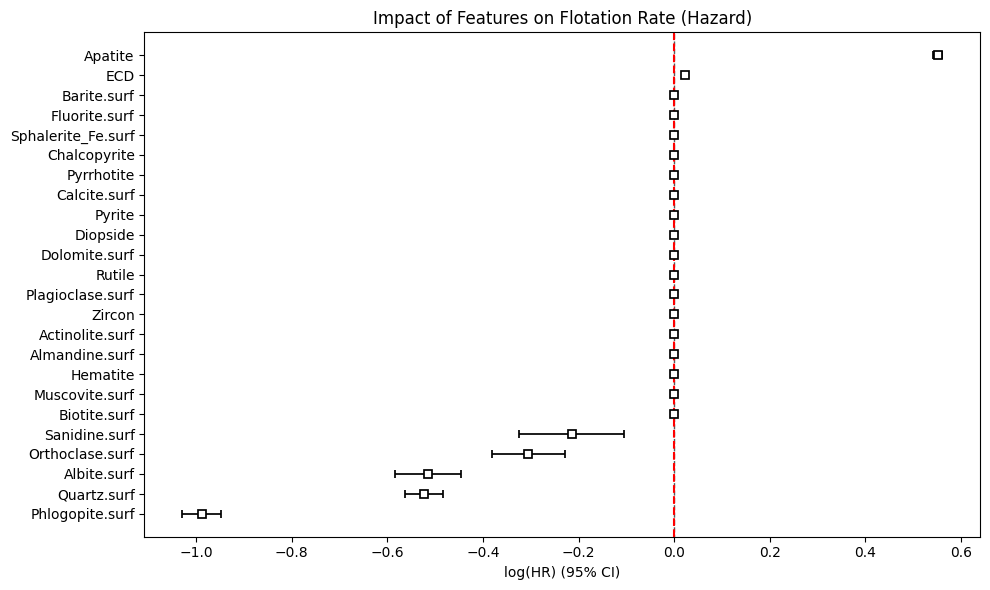
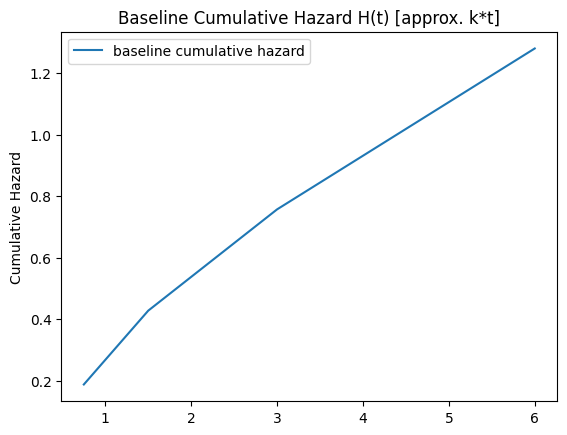
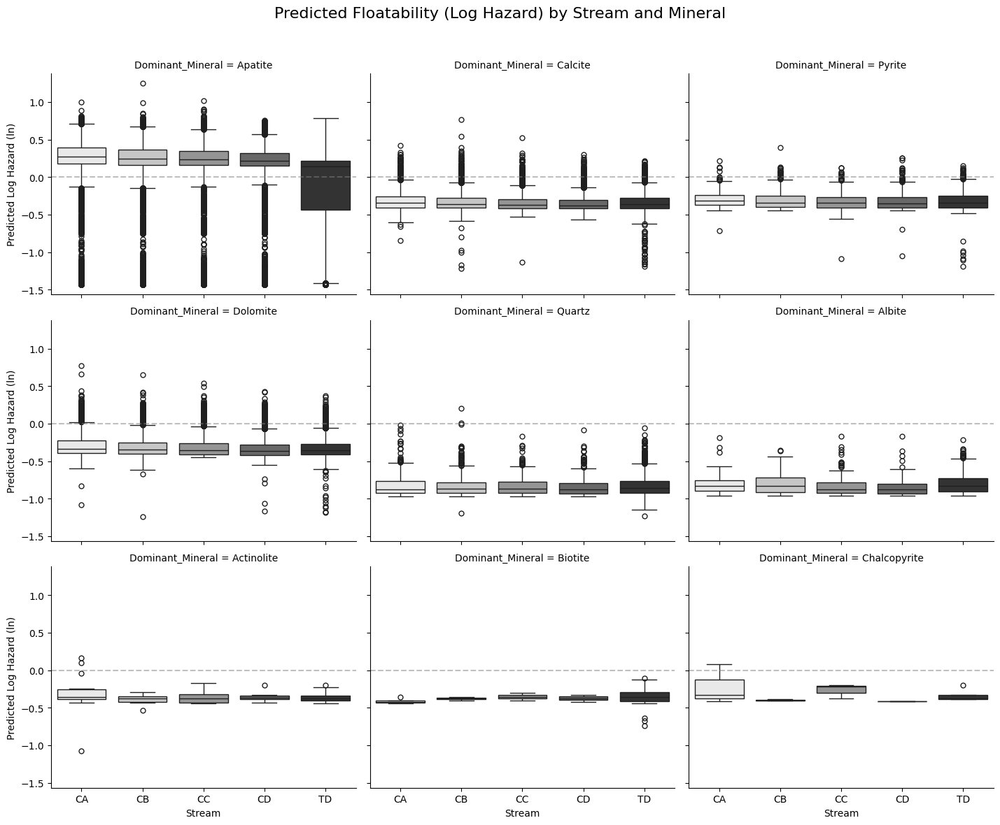
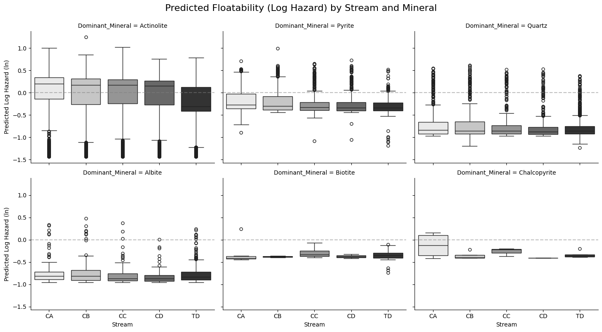
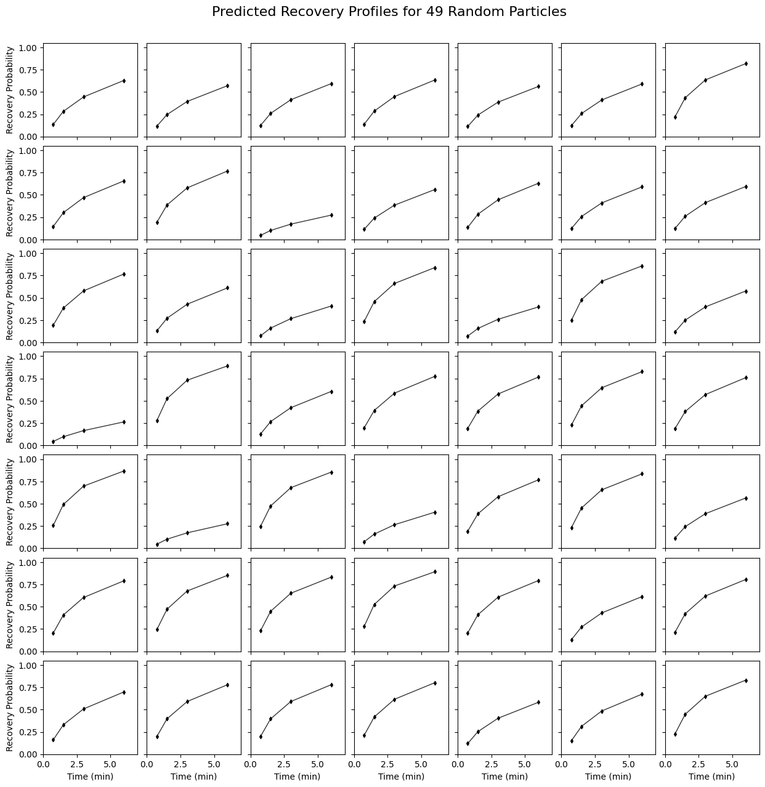
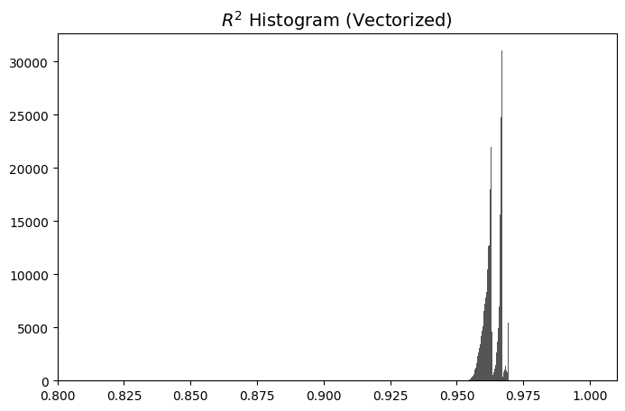
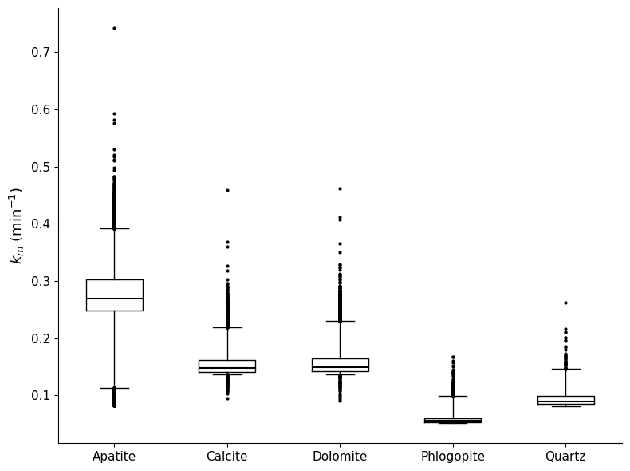
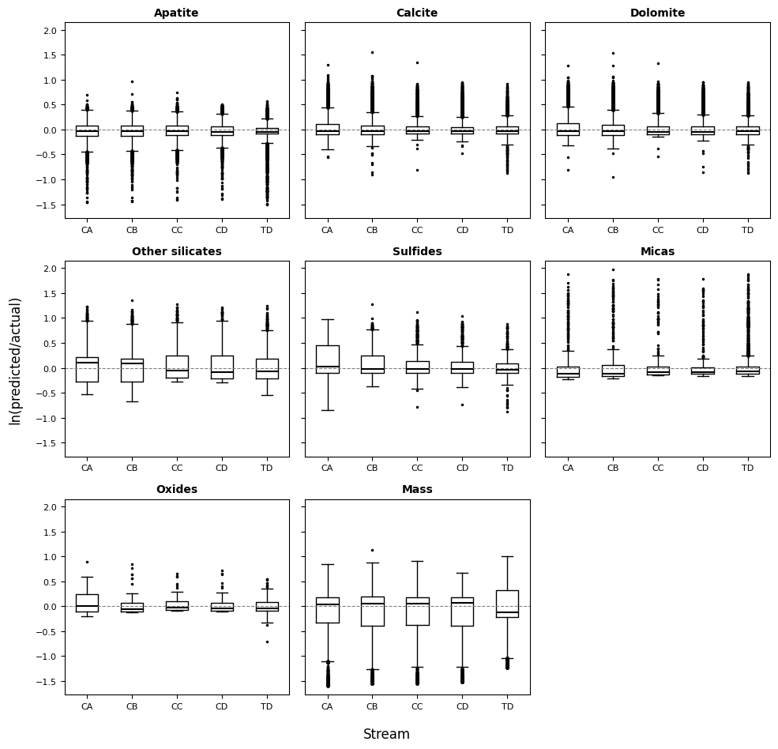

# Results & Interpretation

## Model Overview

A Cox Proportional Hazards model with LASSO regularization was fitted to ~300,000 balanced mineral particle observations from froth flotation experiments. The model treats flotation as a survival process where:

- **Event** = particle is recovered into concentrate (streams CA, CB, CC, CD)
- **Censored** = particle reports to tailings (TD) and is not recovered

Bootstrap aggregation (1000 iterations, 50k subsamples each) was used to ensure stable coefficient estimates. All 1000 bootstrap fits converged successfully.

## Model Performance

| Metric | Value |
|--------|-------|
| Number of observations | 300,000 |
| Events observed | 240,000 |
| Right-censored | 60,000 |
| Concordance index | 0.62 |
| Partial AIC | 5,735,176.37 |
| Mean R² (particle kinetics) | 0.96 |

The concordance of 0.62 indicates the model correctly ranks particles by flotation speed 62% of the time, a reasonable result for individual particle data where stochastic effects are significant.

The mean R² of 0.96 demonstrates that the model reproduces individual particle recovery kinetics very well, validating the survival analysis framework for flotation.

---

## Figure 1: Feature Impact on Flotation Rate (Forest Plot)

This forest plot displays the log-hazard ratio (coefficient) and 95% confidence interval for each feature in the Cox PH model. The dashed red vertical line at zero represents no effect.

### Key Observations

- **Apatite** (top, far right): The only feature with a strong positive coefficient (+0.55), meaning apatite-rich particles float 74% faster than average. This makes physical sense, apatite is the target ore mineral, selectively collected by flotation reagents.

- **ECD** (equivalent circle diameter): A small but highly significant positive effect (+0.02). Larger particles float slightly faster in this size fraction.

- **Phlogopite.surf** (bottom, far left): The strongest negative coefficient (−0.99), meaning particles with phlogopite surface exposure float 63% slower. Phlogopite (mica) surfaces are hydrophilic and resist collector adsorption.

- **Quartz.surf** and **Albite.surf**: Both show significant negative effects (~−0.52), reducing flotation rate by ~40%. These silicate gangue minerals have naturally hydrophilic surfaces.

- **Orthoclase.surf** and **Sanidine.surf**: Moderate negative effects. Both are feldspar minerals with hydrophilic surfaces.

- **Many features driven to zero**: LASSO regularization has effectively eliminated features like Chalcopyrite, Diopside, Pyrite, Rutile, and most minor mineral surface fractions. Their confidence intervals overlap with zero, they do not significantly affect flotation rate in this model.

---

## Figure 2: Baseline Cumulative Hazard

The baseline cumulative hazard H(t) represents the average flotation kinetics when all covariates are at their mean values. It approximates k × t (rate constant × time), providing a proxy for the overall kinetic rate of the flotation process.

### Key Observations

- The curve is approximately linear for t < 2 min, consistent with first-order kinetics where H(t) ≈ k·t.
- The slope gradually decreases at longer times (t > 3 min), reflecting the diminishing rate of recovery as the easily floatable particles are progressively depleted.
- By t = 6 min, H(t) ≈ 1.3, indicating that the average cumulative hazard reaches about 1.3. This translates to a baseline survival probability of S(6) = exp(−1.3) ≈ 0.27, meaning ~73% of average particles are recovered by 6 minutes under baseline conditions.

---

## Figure 3: Predicted Floatability by Stream and Mineral (All Minerals)

This 3×3 faceted boxplot shows the predicted log-hazard (floatability score) for particles grouped by their dominant mineral (panel) and the stream they were collected from (x-axis: CA, CB, CC, CD, TD).

### Key Observations

- **Apatite-dominant particles** (top left): Show the highest predicted floatability with median log-hazard values centered around +0.2 to +0.4. The CA stream (first concentrate) shows the widest spread, indicating a mix of highly floatable and moderately floatable apatite particles. The TD (tailings) stream shows notably lower predicted values, consistent with unfloated apatite being locked with gangue minerals.

- **Calcite, Dolomite, Pyrite-dominant particles**: These groups show uniformly negative predicted log-hazards (around −0.3 to −0.4), indicating slow flotation. There is minimal distinction between streams, suggesting the model predicts low floatability regardless of where these particles actually end up.

- **Quartz and Albite-dominant particles**: Show the most negative predicted values (around −0.8 to −0.9), confirming these silicate gangue minerals are the least floatable. Both show very tight distributions with few outliers.

- **Actinolite, Biotite, Chalcopyrite-dominant particles**: All show moderately negative predicted log-hazards (around −0.3 to −0.5), with Chalcopyrite showing slightly more variation due to its sulfide character.

### Physical Interpretation

The model clearly separates apatite-dominant particles (positive predicted flotation) from all gangue-dominant particles (negative predicted flotation). This separation is the fundamental basis of the flotation process, the model has learned to distinguish the ore mineral from gangue based on particle properties.

---

## Figure 4: Predicted Floatability by Stream and Mineral (Selected Minerals)

This 2×3 faceted boxplot shows a subset of minerals with more detail.

### Key Observations

- **Actinolite-dominant particles**: Show a bimodal distribution with some particles having positive log-hazard (likely locked with apatite) and others strongly negative (pure gangue). This suggests actinolite particles are heterogeneous in their liberation characteristics.

- **Pyrite-dominant particles**: Display moderate negative log-hazard with some outliers extending to positive values. Some pyrite particles may be recovered through inadvertent flotation or association with apatite.

- **Quartz-dominant particles**: Consistently negative (around −0.8), very tight distribution. Quartz is a reliable non-floatable indicator.

- **Albite-dominant particles**: Similar to quartz, uniformly negative with a tighter range in later streams (CC, CD, TD), suggesting consistent rejection of albite across flotation time.

- **Biotite-dominant particles**: Very tight, consistently negative distributions. Biotite surface is strongly hydrophilic.

- **Chalcopyrite-dominant particles**: Show moderate negative values with some positive outliers in the CA stream. Some chalcopyrite may be associated with apatite or may be autonomously floatable through sulfide collector interaction.

---

## Figure 5: Predicted Recovery Profiles for 49 Random Particles

This 7×7 grid of subplots shows the predicted recovery probability over time for 49 randomly selected particles. Each subplot represents one particle, with time (minutes) on the x-axis and recovery probability (0–1) on the y-axis.

### Key Observations

- **Recovery curves follow classic first-order kinetics**: All curves show a characteristic concave-upward shape, starting at 0 and asymptotically approaching a maximum value. This validates the use of survival analysis for modeling flotation.

- **Wide range of predicted recoveries**: Some particles reach ~90–95% recovery by 6 minutes (highly floatable, likely apatite-rich), while others only reach ~10–20% (poorly floatable gangue particles). This range reflects the heterogeneity of the particle population.

- **Early recovery (0–1.5 min) shows the most discrimination**: The steepest part of the curves, where the most separation between floatable and non-floatable particles occurs, is in the first 1–2 minutes. This aligns with practical flotation circuit design, where the early concentrates (CA, CB) are the highest grade.

- **Curve shapes are consistent**: Despite the diversity in final recovery, all curves share the same functional form (exponential approach to a plateau), confirming the model's first-order kinetic assumption is appropriate.

### Physical Interpretation

These profiles demonstrate that the Cox PH survival model can predict individual particle recovery kinetics, not just average behavior, but particle-by-particle trajectories. This is valuable for: (1) circuit simulation, (2) identifying particle types that are slow-floating but ultimately recoverable, and (3) optimizing flotation time to balance recovery vs. grade.

---

## Figure 6: R² Goodness-of-Fit Distribution

This histogram shows the distribution of R² values computed for each particle's predicted vs. observed recovery profile. R² measures how well the model reproduces individual particle kinetics (1.0 = perfect fit).

### Key Observations

- **Mean R² = 0.96**: The model explains 96% of the variance in individual particle recovery on average. 

- **Distribution is sharply peaked around 0.96–0.97**: The vast majority of particles have R² > 0.95, indicating the model consistently fits individual kinetics well across the entire particle population.

- **Very few particles below R² = 0.90**: Only a small tail extends below 0.90, suggesting that outlier particles (unusual mineralogy or liberation) are rare.

- **Multiple discrete peaks**: The histogram shows several narrow peaks (around 0.96, 0.97, 0.98, 1.0). These correspond to particles from different classes (CA, CB, CC, CD, TD), each with a slightly different number of observed time points, producing different R² clusters.

### Physical Interpretation

The high R² values confirm that the survival analysis framework is appropriate for flotation kinetics. The model does not merely predict average behavior, it captures particle-level variation in flotation rates driven by mineralogy, surface composition, and particle size. This level of individual particle modeling supports the use of Cox PH models for understanding and optimizing mineral processing operations.

---

## Figure 7: Kinetic Rate Constants by Dominant Mineral

This boxplot shows the distribution of predicted kinetic rate constants (*k_m*, in min⁻¹) for particles grouped by their dominant mineral. Higher *k_m* values mean faster flotation.

### Key Observations

- **Apatite** has the highest median rate constant (~0.28 min⁻¹) and the widest interquartile range (0.11–0.40 min⁻¹). This reflects both its high floatability and the natural variability in apatite particle properties (liberation, surface coverage, size). Some apatite particles have *k_m* > 0.5 min⁻¹, extremely fast floaters, while others are near 0.1 min⁻¹, likely due to gangue locking.

- **Calcite and Dolomite** have similar median rates (~0.15 min⁻¹), roughly half that of apatite. Both are carbonate minerals that can exhibit some collector uptake but are fundamentally less hydrophobic than apatite. Dolomite shows a slightly wider spread with more high-rate outliers.

- **Phlogopite** has the lowest median rate (~0.05 min⁻¹) and the tightest distribution. This is consistent with the forest plot (Figure 1) where phlogopite surface had the strongest negative coefficient. Mica particles are consistently slow to float.

- **Quartz** is second-lowest (~0.09 min⁻¹) with a moderate spread. Some quartz particles show higher rates (up to ~0.22 min⁻¹), likely due to association with apatite or collector adsorption at specific surface sites.

### Physical Interpretation

The kinetic rate hierarchy: **Apatite >> Calcite ≈ Dolomite > Quartz > Phlogopite** : directly reflects the hydrophobicity spectrum of these minerals. Apatite, the target ore mineral, responds best to fatty acid collectors. Carbonate gangue (calcite, dolomite) shows moderate inadvertent activation. Silicates and micas are naturally hydrophilic and resist collector adsorption. This ranking is critical for circuit design: it determines the required flotation time, the expected grade-recovery trade-off, and which gangue minerals are most likely to contaminate concentrates.

---

## Figure 8: Model Residuals by Mineral Group and Stream

This 3×3 faceted plot shows the ln(predicted/actual) ratio for different mineral groups across flotation streams. Values centered on zero (dashed line) indicate unbiased predictions. Positive values mean over-prediction; negative values mean under-prediction.

### Key Observations

- **Apatite**: Residuals are approximately centered on zero across all streams with modest spread (~±0.5 for the IQR). Slight negative outliers appear in CA and CB streams, suggesting the model occasionally under-predicts recovery for the fastest-floating apatite particles.

- **Calcite**: Shows wider residual spread than apatite, particularly in CA and CB streams with notable negative outliers. The model sometimes under-predicts calcite recovery in early concentrates, indicating some calcite particles are inadvertently recovered faster than expected (possibly due to entrainment or surface activation).

- **Dolomite**: Similar pattern to calcite but with generally tighter residuals centered near zero. The model predicts dolomite behavior well.

- **Other silicates**: Residuals centered near zero with moderate spread. CA stream shows slightly more positive residuals, suggesting the model slightly over-predicts silicate recovery in the first concentrate.

- **Sulfides**: Good centering overall but wider spread in CD and TD streams with notable negative outliers. Some sulfide particles in later streams and tailings are recovered faster than predicted, possibly due to galvanic interactions or collector scavenging.

- **Micas**: The tightest residual distributions of any group, closely centered on zero. The model predicts mica flotation behavior with the highest consistency, reflecting the strong and reliable negative coefficient for phlogopite surface.

- **Oxides**: Moderate spread with some positive outliers in CB and CC streams, indicating occasional over-prediction. Oxide behavior is moderately well captured.

- **Mass**: Shows a distinctive bimodal pattern with both positive and negative tails, particularly visible in CB, CC, CD, and TD streams as long negative whiskers. This reflects the challenge of predicting overall mass recovery accurately at the individual particle level mass recovery integrates multiple mineral components, each with different flotation kinetics.

### Physical Interpretation

Overall, the residual analysis demonstrates that the model is largely unbiased, residuals center near zero for most mineral groups and streams. The tightest fits are for micas (consistent non-floaters) and dolomite (consistent moderate behavior). The widest residuals occur for mass (aggregate recovery) and calcite (variable entrainment behavior). This pattern suggests the model captures intrinsic floatability well but has more difficulty with stochastic effects like entrainment and mechanical carry-over, which are not directly encoded in particle mineralogy.

---

## Significant Features Summary

| Feature | Coefficient | Hazard Ratio | 95% CI | Effect |
|---------|------------|--------------|--------|--------|
| **Apatite** | +0.55 | 1.74 | [0.53, 0.57] | 74% faster flotation (ore mineral) |
| **ECD** | +0.02 | 1.02 | [0.02, 0.03] | Larger particles float slightly faster |
| **Sanidine.surf** | −0.21 | 0.81 | [-0.43, -0.00] | 19% slower flotation |
| **Orthoclase.surf** | −0.30 | 0.74 | [-0.48, -0.12] | 26% slower flotation |
| **Albite.surf** | −0.52 | 0.60 | [-0.69, -0.36] | 40% slower flotation |
| **Quartz.surf** | −0.52 | 0.59 | [-0.62, -0.43] | 41% slower flotation |
| **Phlogopite.surf** | −0.99 | 0.37 | [-1.08, -0.90] | 63% slower flotation |

## Key Physical Insights

### 1. Surface Mineralogy Dominates Over Bulk Composition

The model retained surface exposure fractions (`.surf` features) as the significant gangue predictors while eliminating corresponding bulk composition variables. This confirms that "what is on the particle surface determines flotation behavior?", not what is inside the particle.

### 2. Apatite (Ore) vs. Gangue Surface: A Clear Separation

Particles rich in apatite float rapidly (hazard ratio 1.74), while particles with exposed gangue minerals (phlogopite, quartz, albite, orthoclase) float slowly or not at all. This creates a natural separation basis for flotation circuit optimization.

### 3. Phlogopite is the Most Problematic Gangue Mineral

Phlogopite surface exposure has the strongest negative effect (coefficient −0.99). Mica minerals pose a particular challenge in phosphate flotation because:
- They are platy and tend to be entrained mechanically
- Their basal surfaces are hydrophilic, resisting collector adsorption
- When locked with apatite, they reduce composite particle floatability

### 4. Particle Size Effect

The positive ECD coefficient (+0.023) confirms that larger particles in this size fraction float slightly faster. While the effect is small per micron, it is highly significant (z = 61.5) across the particle size distribution.

---

## Methodology Notes

### Data Balancing
The original dataset (796,130 rows) was balanced to 300,000 rows with 60,000 samples per class (CA20, CB20, CC20, CD20, TD20). This prevents the model from being biased toward overrepresented classes.

### Feature Selection Pipeline
1. **Constant removal**: Dropped Clinochlore and Clinochlore.surf (zero variance)
2. **VIF filtering**: Removed 27 features with VIF > 10, retaining 24 features
3. **LASSO selection**: L1 regularization drove 18 feature coefficients to approximately zero

### Bootstrap Stability
All 1000 bootstrap iterations converged. The narrow confidence intervals (particularly for Apatite, Phlogopite.surf, and Quartz.surf) demonstrate that these features are robust predictors across different data subsets.

---
